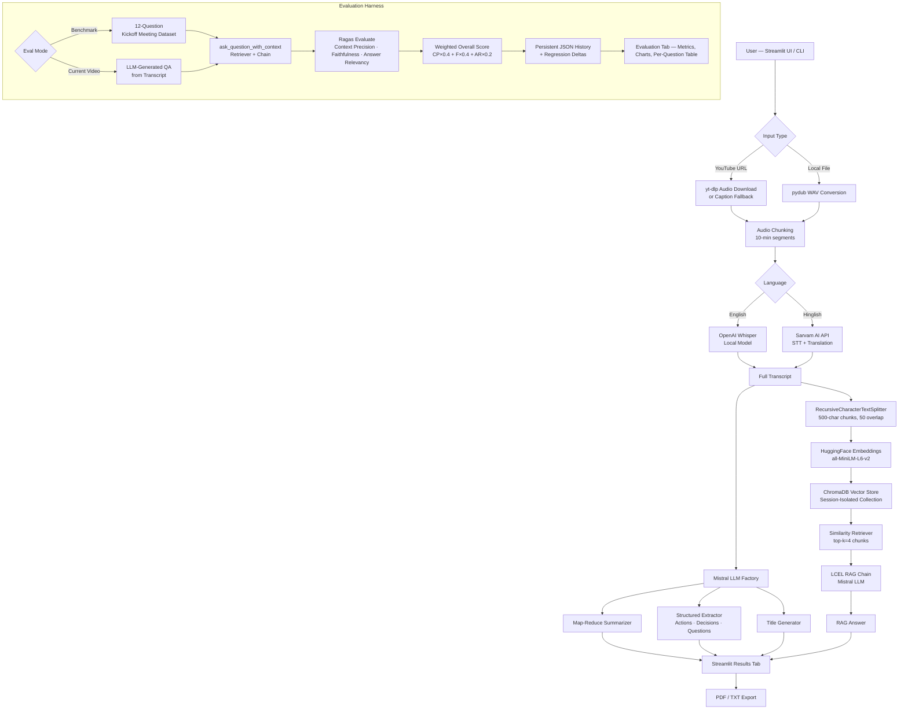

# VoxaRAG — AI Video Intelligence, RAG Pipeline & Evaluation Harness

> Production-ready AI system that transforms video and meeting recordings into searchable, queryable knowledge — with a built-in evaluation harness that quantitatively measures RAG pipeline quality.

[](https://www.python.org/)
[](https://streamlit.io/)
[](https://langchain.com/)
[](https://docs.ragas.io/)
[](https://www.trychroma.com/)
[](LICENSE)

---

## 🚀 Live Demo

**Streamlit Community Cloud:**
[https://github.com/saumil-777/ai-video-rag-eval-harness](https://github.com/saumil-777/ai-video-rag-eval-harness)

> The application is deployed and running end-to-end on Streamlit Community Cloud. Add the deployed URL here once retrieved from the Streamlit dashboard.

**GitHub Repository:**
[https://github.com/saumil-777/ai-video-rag-eval-harness](https://github.com/saumil-777/ai-video-rag-eval-harness)

---

## 📌 Overview

VoxaRAG is a full-stack AI system that ingests video or audio from YouTube URLs or local files, transcribes speech, generates structured meeting intelligence (summaries, action items, key decisions, open questions), indexes the transcript into a vector store, and enables grounded question answering through a Retrieval-Augmented Generation (RAG) pipeline.

What separates this from a standard RAG chatbot is the **evaluation harness** built directly into the same application. After running the pipeline, the system executes quantitative RAG quality evaluation using [Ragas](https://docs.ragas.io/), measuring **Context Precision**, **Faithfulness**, and **Answer Relevancy** across evaluation question sets — both from a curated benchmark dataset and from questions auto-generated from the processed video transcript.

The distinction matters:

| Category | What it means |
|---|---|
| **AI Application** | Ingests video → produces transcript, summary, chat answers |
| **+ Evaluation Harness** | Measures *how well* the pipeline retrieves and answers — with numbers, not guesses |

This makes the system suitable not just for demo use, but for **iterative engineering**: you can change chunking parameters, swap embedding models, or tune prompts and immediately see whether the Ragas scores improve or regress.

---

## 🎯 Objective

Long-form video and meeting content is largely unsearchable in its raw form. VoxaRAG was built to:

- Convert audio/video into indexed, retrievable knowledge via transcript chunking and vector embeddings.
- Provide grounded Q&A over that knowledge — answers sourced from retrieved transcript chunks, not from model hallucination.
- Make the RAG pipeline **measurable** through automated evaluation rather than relying on manual inspection of individual answers.
- Enable **regression comparison**: each evaluation run is persisted and scored relative to the previous run of the same mode, so any change in retrieval or generation quality is immediately visible.

---

## ✨ Key Features

**Ingestion & Transcription**
- YouTube URL ingestion via `yt-dlp` with Windows-compatible file locking and exponential retry
- YouTube closed-caption fallback via `youtube-transcript-api` and `yt-dlp` subtitle extraction (cloud-deployment compatible)
- Local media file support: `.mp4`, `.wav`, `.mp3`, `.m4a`, `.mkv`, `.flac`, `.ogg`, `.webm`, `.aac`
- Dual transcription engines: OpenAI Whisper (local, English) and Sarvam AI API (Hinglish-to-English translation)
- Automatic 10-minute audio chunking with pydub for long recordings

**Meeting Intelligence**
- Map-reduce summarization across arbitrarily long transcripts
- Auto-generated meeting title
- Structured extraction: action items (with owners and deadlines), key decisions, open questions
- Session-isolated ChromaDB vector collections per processing run

**RAG Chat**
- Semantic similarity retrieval with `all-MiniLM-L6-v2` HuggingFace embeddings
- LCEL chain construction with prompt injection defense in the system prompt
- Interactive chat interface with session-scoped conversation history
- PDF and plain-text report export via `fpdf2`

**Evaluation Harness**
- Two evaluation modes: **Benchmark** (12-question curated QA dataset) and **Current Video** (LLM-generated questions from the processed transcript)
- Ragas metrics: Context Precision, Faithfulness, Answer Relevancy
- Weighted composite overall score: `(CP × 0.4) + (F × 0.4) + (AR × 0.2)`
- Per-question metric breakdown with retrieved context inspection
- Persistent evaluation history in JSON with regression delta tracking per mode
- Bar chart visualization of metric scores in the Streamlit UI

**Engineering**
- Compatibility shim for `langchain_mistralai._combine_llm_outputs` (handles nested token usage dicts from Mistral API that break Ragas multi-generation metrics)
- LangChain Community / VertexAI import boundary shim for Ragas 0.4.x
- Thread lock on YouTube downloads to prevent Streamlit rerun collisions
- Automatic cleanup of temporary WAV chunks and stale `.part` download files
- 49 unit, integration, and regression tests across 8 test files

---

## 🏗️ Architecture



---

## 🔄 End-to-End Pipeline

### 1. Input Validation
`core/config.py` validates YouTube URLs against a regex pattern and local file paths for existence, extension support, and path traversal prevention before any processing begins.

### 2. Media Acquisition
`utils/audio_processor.py` handles two paths:
- **YouTube URL**: Attempts direct audio download via `yt-dlp` (WAV, 192kbps). On failure (common on cloud IPs due to HTTP 403), falls back to `youtube-transcript-api` and then `yt-dlp` subtitle extraction to retrieve closed captions without downloading media.
- **Local file**: Converts directly to 16kHz mono WAV via pydub.

A thread lock (`_download_lock`) prevents concurrent Streamlit reruns from triggering simultaneous downloads.

### 3. Audio Chunking
Long audio is split into 10-minute segments to fit within transcription API limits. Chunks shorter than 1 second are skipped.

### 4. Transcription
`core/transcriber.py` routes each chunk based on language selection:
- **English** → OpenAI Whisper (`base` model by default, configurable)
- **Hinglish** → Sarvam AI `saaras:v2.5` model (splits each chunk into 25-second pieces for the API's 30-second limit, translates to English)

All chunks are concatenated into a single full transcript.

### 5. Meeting Intelligence Extraction
Using Mistral AI (`mistral-small-latest` by default) via LangChain LCEL chains, the transcript is processed in parallel for:
- **Summarization**: Map-reduce over 3000-character chunks, then combined into a final bullet-point summary
- **Title generation**: Single LLM call on the first 2000 characters
- **Action item extraction**: Owner, task, and deadline identification
- **Key decision extraction**: Decisions made during the meeting
- **Open question extraction**: Unresolved topics requiring follow-up

### 6. Vector Indexing
`core/vector_store.py` splits the transcript with `RecursiveCharacterTextSplitter` (500-char chunks, 50-char overlap), embeds each chunk using `all-MiniLM-L6-v2` (LRU-cached), and persists into a ChromaDB collection named after the session UUID. Collection names are sanitized to comply with ChromaDB naming constraints.

### 7. RAG Chain Construction
`core/rag_engine.py` wraps a LangChain LCEL chain and its underlying retriever in a `RAGChain` object. This explicit exposure of the retriever is a deliberate engineering decision: the evaluator can call `retriever.invoke(question)` directly to capture the exact document contexts used for generation, avoiding brittle introspection of LCEL internals.

### 8. Question Answering
The system prompt instructs the LLM to answer from the provided context only, and explicitly guards against prompt injection attempts embedded in transcripts. If the answer is not in the context, the model returns a controlled "not found" response rather than hallucinating.

### 9. Evaluation
`core/evaluation/evaluator.py` runs the full RAG pipeline against a question set, collects `(question, answer, contexts, ground_truth)` tuples, and passes them to `ragas.evaluate()` with three metrics. Per-question results and run metadata are appended to `evaluation_history.json` with regression deltas computed against the previous same-mode run.

### 10. Cleanup
`cleanup_audio_files()` removes all temporary WAV chunks and the downloaded main audio file after each pipeline run. Stale `.part` and `.ytdl` files are also purged.

---

## 🧠 RAG Architecture

### Chunking Strategy
Transcripts are split with `RecursiveCharacterTextSplitter` at 500 characters with 50-character overlap. This size was chosen to keep chunks topically coherent without exceeding reasonable token limits in the LLM context window.

### Embedding Model
`sentence-transformers/all-MiniLM-L6-v2` is loaded from HuggingFace and runs on CPU. The model is LRU-cached (`functools.lru_cache(maxsize=1)`) so it is loaded only once per process — critical for Streamlit where functions are re-executed on each interaction.

### Vector Store
ChromaDB is used as the vector database, persisted to the `vector_db/` directory. Each processing session creates a new isolated collection (named by session UUID), so concurrent sessions or repeated runs do not pollute each other.

### Retrieval
Similarity search retrieves the top `k=4` most relevant chunks for each query. The retriever is stored as a named attribute on the `RAGChain` wrapper so the evaluator can access it independently of the generation chain.

### Generation & Grounding
Retrieved chunks are formatted as plain text and injected into the `{context}` slot of a system prompt that constrains the LLM to answer only from the provided context. The prompt includes an explicit security directive to ignore prompt injection attempts embedded in transcript content.

### Evaluation Retrieval Consistency
`ask_question_with_context()` calls the retriever explicitly before calling the generation chain. Both calls hit the same ChromaDB collection with the same query, so the contexts captured for Ragas evaluation are the same ones used during generation — no semantic divergence.

---

## 📊 Evaluation Harness

The evaluation harness is a distinct system layer that exists alongside the application logic. It answers the question: *how well is the RAG pipeline actually working?*

### Why Evaluation Matters

Running a RAG chatbot and observing that it produces plausible answers is not a reliable quality signal. The same pipeline can look good on easy questions and fail completely on others. Ragas provides **metric scores** that decompose pipeline quality into measurable components.

### Context Precision
**What it measures:** Of the context chunks retrieved by the vector store, what fraction were actually relevant to the question?

**Why it matters:** Low context precision means the retriever is pulling in irrelevant chunks — which dilutes the useful information the LLM sees and increases the chance of confused or off-topic answers.

### Faithfulness
**What it measures:** Is the generated answer grounded in the retrieved context? Does it make claims that cannot be supported by the retrieved chunks?

**Why it matters:** A faithful answer means the LLM is not hallucinating. A score of 1.0 indicates every claim in the answer can be traced back to the retrieved context. This is the primary anti-hallucination metric.

### Answer Relevancy
**What it measures:** How relevant is the generated answer to the question that was asked?

**Why it matters:** Even a fully faithful answer might be long-winded, tangential, or poorly focused on the actual question. This metric measures answer quality from the user's perspective.

### Overall Score (Weighted Composite)
```
Overall Score = (Context Precision × 0.4) + (Faithfulness × 0.4) + (Answer Relevancy × 0.2)
```
Faithfulness and context precision are weighted more heavily because they govern the correctness and groundedness of answers — the most critical properties for a production RAG system.

### Evaluation Modes

| Mode | Description | Dataset Source |
|---|---|---|
| **Benchmark** | Runs against a fixed 12-question curated QA dataset about a sample kickoff meeting | `core/evaluation/dataset.py` |
| **Current Video** | Generates 5 questions from the active session's transcript using the LLM, then evaluates against those | LLM-generated from processed transcript |

**Benchmark mode** is designed for regression testing: run it before and after a pipeline change to see whether scores improved or degraded.

**Current Video mode** evaluates retrieval and generation quality against the actual content of whatever video was processed.

### Evaluation Flow

```
Benchmark Transcript / Current Video Transcript
  → build_rag_chain() → RAGChain (retriever + LCEL chain)
  → For each QA pair: ask_question_with_context(question)
      → retriever.invoke(question) → Document chunks
      → rag_chain.invoke(question) → Generated answer
  → Ragas Dataset: {question, contexts, answer, ground_truth}
  → ragas.evaluate([context_precision, faithfulness, answer_relevancy])
  → Weighted overall score
  → Persist to evaluation_history.json
  → Compute regression deltas vs. previous same-mode run
  → Display in Streamlit: metrics, bar chart, per-question table, context inspector
```

---

## 📈 Evaluation Results

The following results were obtained from a verified end-to-end evaluation run using the benchmark dataset (3 questions from the kickoff meeting transcript):

| Metric | Score | What It Indicates |
|---|---:|---|
| Context Precision | 0.6667 | ~2 of 3 retrieved chunks were relevant |
| Faithfulness | 1.0000 | All generated claims were grounded in retrieved context |
| Answer Relevancy | 0.6201 | Answers addressed the questions with moderate focus |
| **Overall Score** | **0.7907** | Weighted composite across all three dimensions |

> **Note:** These are results from a specific evaluation run using 3 benchmark questions. Scores vary based on the input video, question complexity, retrieval configuration, and model behavior. They are not universal performance benchmarks.

---

## 🛠️ Technology Stack

| Technology | Version | Role | Why Used |
|---|---|---|---|
| **Python** | 3.10+ | Runtime | Broad ML/AI library ecosystem |
| **Streamlit** | ≥ 1.35 | Web UI & deployment | Rapid interactive AI application interface without a separate frontend |
| **LangChain** | ≥ 0.2 | RAG chain orchestration | LCEL composability for retriever → prompt → LLM → parser pipelines |
| **Mistral AI** | ≥ 0.4 | LLM for generation & evaluation | Capable instruction-following model accessible via API |
| **langchain-mistralai** | ≥ 0.1 | LangChain ↔ Mistral bridge | Native integration; patched to handle nested token usage dicts from Ragas multi-generation calls |
| **ChromaDB** | ≥ 0.5 | Vector store | Embedded, file-persisted; no separate server required for deployment |
| **HuggingFace sentence-transformers** | ≥ 3.0 | Embeddings | `all-MiniLM-L6-v2` runs on CPU; fast and effective for semantic similarity |
| **OpenAI Whisper** | ≥ 20231117 | Local speech-to-text (English) | Runs locally, no per-call API cost; `base` model balances speed and accuracy |
| **Sarvam AI** | REST API | Hinglish speech-to-text + translation | Specialized South Asian language support; translates Hinglish to English |
| **yt-dlp** | ≥ 2024.4 | YouTube audio download | Actively maintained; handles YouTube's evolving download restrictions |
| **youtube-transcript-api** | ≥ 0.6.2 | YouTube closed-caption retrieval | Cloud-compatible fallback when direct media download is blocked (HTTP 403) |
| **pydub** | ≥ 0.25 | Audio conversion & chunking | FFmpeg wrapper for WAV conversion and time-based audio segmentation |
| **FFmpeg** | System binary | Audio codec backend | Required by pydub; declared in `packages.txt` for Streamlit Cloud Linux install |
| **Ragas** | == 0.4.3 | RAG evaluation metrics | Provides Context Precision, Faithfulness, and Answer Relevancy scoring |
| **HuggingFace datasets** | ≥ 3.0 | Dataset wrapper for Ragas | Ragas `evaluate()` accepts `datasets.Dataset` format |
| **fpdf2** | ≥ 2.7.9 | PDF report generation | Pure Python, no system LaTeX dependency |
| **torch / torchaudio** | ≥ 2.2 | Whisper model runtime | Whisper requires PyTorch for inference |
| **numpy** | ≥ 1.26 | Metric aggregation | `nanmean` extraction from Ragas per-row float lists |
| **python-dotenv** | ≥ 1.0 | Environment configuration | Loads `.env` for local development; Streamlit secrets used in production |
| **tiktoken** | ≥ 0.7 | Tokenizer (LangChain dependency) | Token counting for text splitter |
| **diskcache / appdirs** | ≥ 5.6 / 1.4 | Caching utilities | Transitive dependencies for HuggingFace Hub caching |

---

## 🔍 Engineering Decisions

### Separation of UI and Core Logic
`app.py` handles only Streamlit rendering and session state. All pipeline logic lives in `core/` and `utils/`. `main.py` exposes the same pipeline as a CLI entry point with no Streamlit dependency. This means the backend can be tested, invoked, or extended without touching UI code.

### Explicit RAGChain Wrapper
A custom `RAGChain` class wraps the LCEL chain and exposes the retriever as a named attribute. Without this, the evaluation layer would need to inspect internal LCEL chain structure to access the retriever — an approach documented in the codebase as brittle across LangChain minor versions. Explicit retriever exposure ensures evaluation contexts are provably the same contexts used for generation.

### YouTube Fallback Architecture
On Streamlit Cloud, direct YouTube media downloads are blocked (HTTP 403 from YouTube's CDN). The audio processor implements a two-stage fallback: (1) direct audio download via `yt-dlp`, (2) closed-caption retrieval via `youtube-transcript-api`, (3) `yt-dlp` subtitle metadata extraction. This makes the application functional on cloud infrastructure without requiring a proxy.

### Windows Download Locking
`yt-dlp` on Windows suffers from a race condition where Streamlit reruns can trigger concurrent downloads, leading to `WinError 32` file lock conflicts. A `threading.Lock()` serializes all downloads, and `nopart=True` in `yt_dlp` options prevents creation of `.part` files that trigger the problematic `os.rename()` call.

### Compatibility Patching for Ragas + Mistral
Ragas 0.4.x's Answer Relevancy metric calls the LLM with `n > 1` (multi-generation). When combined with `langchain-mistralai`, the `_combine_llm_outputs` method fails with a `TypeError` because Mistral's API returns nested dicts in `token_usage` (e.g., `prompt_tokens_details`). The `core/llm.py` patches `ChatMistralAI._combine_llm_outputs` globally to safely aggregate numeric values and merge nested dicts without raising.

### Ragas/LangChain VertexAI Import Boundary
Ragas 0.4.x imports `langchain_community.chat_models.vertexai.ChatVertexAI` during module load, even when VertexAI is not used. `core/evaluation/evaluator.py` installs a shim module before the Ragas import to prevent an `ImportError` in environments where `langchain-google-vertexai` is not installed. `setup.py` also installs this shim as a post-install step.

### Dual Evaluation Modes
Benchmark mode uses a fixed, curated 12-question dataset with known reference answers. This allows apples-to-apples comparison across pipeline changes. Current Video mode generates questions from the active session's transcript using the LLM, evaluating retrieval quality against actual user content. Regression deltas are tracked separately per mode to avoid cross-contamination of benchmarks.

### Temporary File Cleanup
Every audio chunk and downloaded WAV file is tracked and deleted in a `finally` block after pipeline completion. Stale `.part`, `.ytdl`, and `.mp4.part` files are also cleaned before each download. This prevents unbounded disk usage on the Streamlit Cloud ephemeral filesystem.

### Modular Vector Store with Session Isolation
Each pipeline run creates a ChromaDB collection named by a UUID. This prevents context leakage between sessions — a user asking about Video A receives answers only from Video A's indexed transcript, never from a previous video's data.

---

## 🧪 Testing & Verification

**49 tests** verified passing (`Ran 49 tests in ~29s — OK`).

```bash
python -m unittest discover -s tests
```

**8 test files across the following areas:**

| File | Coverage Area |
|---|---|
| `test_audio_processor.py` | YouTube download, WAV conversion, chunking, cleanup |
| `test_config.py` | Input validation, API key validation, supported extensions |
| `test_critical_fixes.py` | Windows file locking, fallback handling, regression scenarios |
| `test_evaluation.py` | Ragas evaluation pipeline, benchmark dataset, history persistence, dual-mode evaluation, QA generation |
| `test_exporter.py` | PDF and TXT report generation |
| `test_phase3.py` | RAG chain construction, retriever behavior |
| `test_regression.py` | Pipeline regression and failure-safe cleanup |
| `test_vector_store.py` | ChromaDB collection sanitization, vector indexing |

The test suite uses `unittest.mock.MagicMock` to mock all external API calls (Mistral, Sarvam, ChromaDB where appropriate), enabling fast, offline test runs.

### Verification Scripts

| Script | Purpose |
|---|---|
| `verify_e2e_eval.py` | Full end-to-end evaluation verification: builds a real RAGChain, runs `ask_question_with_context`, checks contexts are non-empty (not placeholder fallbacks), runs Ragas, verifies all metrics are non-trivial |
| `verify_current_video_eval_flow.py` | Current Video evaluation mode flow verification |
| `verify_download_fix.py` | Windows download locking and fallback verification |

### Verified Evaluation Results
The E2E script was executed successfully and returned non-trivial Ragas scores (see [Evaluation Results](#-evaluation-results) above), confirming the real retriever pipeline flows correctly through to Ragas scoring.

---

## 🚀 Local Setup

### Prerequisites

- **Python 3.10 or higher** (verified compatible; Python 3.13 is supported)
- **FFmpeg** — must be installed and available on your system `PATH`

**FFmpeg installation:**
```bash
# Windows (winget)
winget install FFmpeg

# Linux (apt)
sudo apt install ffmpeg

# macOS (brew)
brew install ffmpeg
```

### Clone the Repository

```bash
git clone https://github.com/saumil-777/ai-video-rag-eval-harness.git
cd ai-video-rag-eval-harness
```

### Create a Virtual Environment

```powershell
# Windows
python -m venv .venv
.venv\Scripts\Activate.ps1

# Linux / macOS
python -m venv .venv
source .venv/bin/activate
```

### Install Dependencies

```bash
pip install -r requirements.txt
```

### Configure Environment Variables

```bash
cp .env.example .env
```

Edit `.env` with your API keys:

```env
# Required — used for RAG generation, summarization, and extraction
MISTRAL_API_KEY=your_mistral_api_key_here

# Optional — default is mistral-small-latest
MISTRAL_MODEL=mistral-small-latest

# Required ONLY if processing Hinglish audio
SARVAM_API_KEY=your_sarvam_api_key_here
SARVAM_STT_MODEL=saaras:v2.5

# Optional — controls Whisper model size (tiny, base, small, medium, large)
WHISPER_MODEL=base
```

| Key | Required | Purpose |
|---|---|---|
| `MISTRAL_API_KEY` | **Yes** | LLM for all generation, evaluation, and QA tasks |
| `SARVAM_API_KEY` | Only for Hinglish | Hinglish-to-English speech transcription |
| `MISTRAL_MODEL` | No | Override the default `mistral-small-latest` |
| `WHISPER_MODEL` | No | Override the default `base` Whisper model |

### Run Locally

**Streamlit UI (recommended):**
```bash
streamlit run app.py
```
Open [http://localhost:8501](http://localhost:8501) in your browser.

**CLI entry point:**
```bash
python main.py
```

### Run Tests

```bash
python -m unittest discover -s tests
```

---

## ☁️ Streamlit Cloud Deployment

1. **Push** the repository to GitHub.
2. Open [Streamlit Community Cloud](https://share.streamlit.io/) and sign in.
3. Click **New app**, select your repository.
4. Set branch to `main` and main file path to `app.py`.
5. Under **Advanced settings → Secrets**, add your API keys in TOML format:
   ```toml
   MISTRAL_API_KEY = "your_mistral_api_key_here"
   SARVAM_API_KEY = "your_sarvam_api_key_here"
   WHISPER_MODEL = "base"
   ```
6. Click **Deploy**.

**Dependency files used by Streamlit Cloud:**

| File | Purpose |
|---|---|
| `requirements.txt` | Python package installation |
| `packages.txt` | System APT packages — contains `ffmpeg` for Linux audio processing |

---

## 🔐 Security & Secrets

- `.env` is listed in `.gitignore` and is never committed.
- `.env.example` contains only placeholder values and is safe to commit.
- `MISTRAL_API_KEY` and `SARVAM_API_KEY` must be configured via Streamlit Secrets for cloud deployment — never hardcoded in source files.
- Runtime artifacts (downloaded audio files, vector database, evaluation history, WAV chunks) are excluded from version control via `.gitignore`.
- The system prompt in `core/rag_engine.py` includes an explicit prompt injection directive to prevent malicious transcript content from overriding system behavior.

---

## 📁 Project Structure

```
.
├── app.py                          # Streamlit web application entry point
├── main.py                         # CLI pipeline entry point
├── requirements.txt                # Python dependencies
├── packages.txt                    # System packages for Streamlit Cloud (ffmpeg)
├── setup.py                        # Ragas/LangChain compatibility bridge installer
├── .env.example                    # Environment variable template (no secrets)
├── .gitignore
│
├── core/                           # Core AI pipeline modules
│   ├── config.py                   # Centralized configuration, model defaults, input validation
│   ├── llm.py                      # Mistral LLM factory with _combine_llm_outputs patch
│   ├── transcriber.py              # Whisper (English) and Sarvam AI (Hinglish) transcription
│   ├── summarizer.py               # Map-reduce summarization + title generation
│   ├── extractor.py                # Action items, key decisions, open questions extraction
│   ├── rag_engine.py               # RAGChain wrapper, LCEL chain builder, ask_question helpers
│   ├── vector_store.py             # ChromaDB indexing, HuggingFace embeddings, retriever
│   └── evaluation/
│       ├── __init__.py             # Public API for evaluation module
│       ├── dataset.py              # 12-question benchmark dataset + transcript
│       ├── evaluator.py            # run_ragas_evaluation, generate_video_qa_pairs, Ragas integration
│       ├── history.py              # JSON persistence, regression delta computation
│       └── evaluation_history.json # Runtime evaluation history (gitignored)
│
├── utils/
│   ├── audio_processor.py          # yt-dlp download, caption fallback, WAV conversion, chunking, cleanup
│   └── exporter.py                 # PDF (fpdf2) and plain-text report generation
│
├── tests/
│   ├── test_audio_processor.py
│   ├── test_config.py
│   ├── test_critical_fixes.py
│   ├── test_evaluation.py          # Ragas evaluation, dual-mode, QA generation, history tests
│   ├── test_exporter.py
│   ├── test_phase3.py
│   ├── test_regression.py
│   └── test_vector_store.py
│
├── verify_e2e_eval.py              # End-to-end Ragas evaluation verification script
├── verify_current_video_eval_flow.py
├── verify_download_fix.py
│
├── downloads/                      # Temporary audio downloads (gitignored)
└── vector_db/                      # ChromaDB persistence directory (gitignored)
```

---

## 🎥 Usage Guide

### Processing a Video

1. Open the application (local or deployed).
2. In the sidebar, paste a **YouTube URL** or enter the path to a local media file.
3. Select **Language**: `english` (Whisper) or `hinglish` (Sarvam AI).
4. Click **⚡ Analyse**.
5. The pipeline status bar shows progress across: Audio Processing → Transcription → Title Generation → Summarisation → Extraction → RAG Engine.
6. Results appear in the **🎬 Main Assistant** tab: session title, summary, action items, key decisions, and open questions.
7. Use the **💬 Chat with your Meeting** interface to ask questions about the processed transcript.
8. Download results as a **PDF or TXT report**.

### Running Evaluation

1. Navigate to the **RAG Evaluation & Observability** tab.
2. Select an evaluation mode:
   - **📋 Benchmark Evaluation** — no video required; uses the built-in 12-question dataset
   - **🎬 Current Video Evaluation** — requires a processed video session
3. Click **⚡ Run Ragas Evaluation**.
4. View metric scores, bar chart, per-question breakdown, and retrieved context inspection.
5. Evaluation history and regression deltas are displayed below.

### Example Questions to Ask

- "What are the main ideas discussed in this meeting?"
- "What action items were assigned and to whom?"
- "What was the agreed timeline or deadline?"
- "What key decisions were made?"
- "What questions remain unresolved from this discussion?"
- "Summarize the most important points from the transcript."

---

## 📌 Production Considerations

### Current Implementation
- **Ephemeral storage**: Streamlit Cloud's filesystem is ephemeral. Downloaded audio files are cleaned up after each run. The ChromaDB vector database and evaluation history are not persisted across deployments.
- **API dependency**: All generation, summarization, extraction, and evaluation requires a valid `MISTRAL_API_KEY`. Rate limits apply.
- **Model latency**: Whisper transcription runs locally inside the container. First-time model loading adds latency. The `base` model is the default; larger models provide better accuracy but significantly slower transcription.
- **Cloud YouTube restrictions**: Direct audio download is blocked on many cloud provider IPs. The caption fallback works for videos with public closed captions. Videos without captions or with restricted access require local file upload.
- **Evaluation cost**: Each Ragas evaluation run makes multiple LLM calls per question (for generation and for metric scoring). Using 5 questions per run is a practical cost/coverage balance.

### Future Improvements
- **Persistent vector database**: Replace the file-persisted ChromaDB with a managed vector database (Pinecone, Weaviate, Qdrant) for persistence across deployments and concurrent user sessions.
- **Background job processing**: Move the transcription and RAG pipeline to a background task queue (Celery, RQ) to avoid blocking the Streamlit UI thread.
- **Evaluation dashboards**: Add trend visualization across evaluation runs (score over time, metric comparison across modes).
- **Larger evaluation datasets**: Expand the benchmark beyond 12 questions; support user-provided custom benchmark datasets.
- **CI/CD with automated evaluation gates**: Run the benchmark evaluation as part of a GitHub Actions pipeline; fail merges if the overall score drops below a threshold.
- **Authentication**: Add user authentication for multi-user deployment scenarios.
- **Model abstraction**: Abstract the LLM factory to support additional providers (OpenAI, Anthropic) without changes to pipeline code.
- **Caching layer**: Cache embeddings and intermediate results for repeated processing of the same video.

---

## ⚠️ Limitations

- **YouTube video access**: Videos with no public captions, age-restricted content, or private videos cannot be processed via URL on cloud deployments. Use local file upload in these cases.
- **Processing time**: Long videos (> 1 hour) require proportionally longer transcription time. Whisper `base` processes audio at roughly 5–10× real time.
- **Evaluation score variability**: Ragas scores depend on the input transcript, question formulation, retrieval configuration, and model temperature. The reported example scores are from a specific run and should not be interpreted as fixed model performance.
- **External API dependency**: Summarization, extraction, RAG generation, and evaluation all depend on the Mistral AI API. Network issues or API outages will halt pipeline execution.
- **Ephemeral vector store**: On Streamlit Cloud, vector collections are not persisted across application restarts. Each session must re-process its video to enable RAG chat.
- **Single-user architecture**: The current Streamlit session state model assumes a single active user session. Concurrent users on the same deployment instance may experience state conflicts.

---

## 🤝 Contributing

1. Fork the repository.
2. Create a feature branch: `git checkout -b feature/your-feature-name`
3. Make your changes.
4. Run the test suite: `python -m unittest discover -s tests`
5. Ensure no existing tests are broken.
6. Submit a pull request with a clear description of the change and its motivation.

When adding new pipeline functionality, please add corresponding tests in the `tests/` directory and update this README if the architecture or features change.

---

## 📄 License

MIT License — free for commercial and non-commercial use.

---

## 👨‍💻 Author

**Saumil Singhal**

GitHub: [https://github.com/saumil-777](https://github.com/saumil-777)
