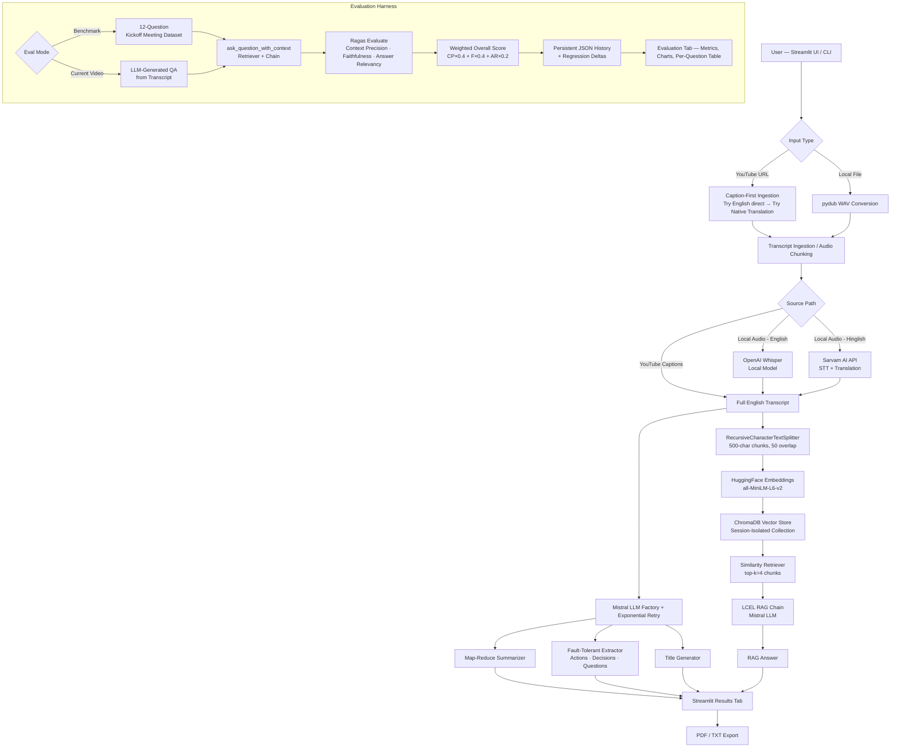

# VoxaRAG — AI Video Intelligence, RAG Pipeline & Evaluation Harness

> Production-ready AI system that transforms video and meeting recordings into searchable, queryable knowledge — with a built-in evaluation harness that quantitatively measures RAG pipeline quality.

[](https://www.python.org/)
[](https://streamlit.io/)
[](https://langchain.com/)
[](https://docs.ragas.io/)
[](https://www.trychroma.com/)
[](LICENSE)

---
## 🎥 Demo Video

Watch the complete walkthrough of the AI Video Assistant, including YouTube ingestion, transcription, summarization, action-item extraction, and RAG-powered chat.

▶️ [Watch the Demo Video](./Demo/Screen%20Recording%202026-09-01%20191123.mp4)

## 📸 Application Screenshots

### 1. Main Assistant — Meeting Summary & Transcript


### 2. Interactive RAG Chat & Report Export


### 3. RAG Quality Evaluation & Observability Dashboard


### 4. Per-Question Metric Breakdown & Context Inspection


### 5. Persistent Evaluation History & Regression Tracking


## 🚀 Live Demo

**Live Application (Streamlit Community Cloud):**  
[https://ai-video-rag-eval-harness-drtkntkzqzbjcpmgqbw5tu.streamlit.app/](https://ai-video-rag-eval-harness-drtkntkzqzbjcpmgqbw5tu.streamlit.app/)

**GitHub Repository:**  
[https://github.com/saumil-777/ai-video-rag-eval-harness](https://github.com/saumil-777/ai-video-rag-eval-harness)

> **Deployment Note:** The application is deployed and running end-to-end on **Streamlit Community Cloud**. API credentials (`MISTRAL_API_KEY`, etc.) are pre-configured via Streamlit Cloud Secrets, allowing recruiters and reviewers to test the live application immediately without entering their own API keys.

---

## 📌 Overview

VoxaRAG is a full-stack AI system that ingests video or audio from YouTube URLs, transcribes speech, generates structured meeting intelligence (summaries, action items, key decisions, open questions), indexes the transcript into a vector store, and enables grounded question answering through a Retrieval-Augmented Generation (RAG) pipeline.

What separates this from a standard RAG chatbot is the **evaluation harness** built directly into the same application. After running the pipeline, the system executes quantitative RAG quality evaluation using [Ragas](https://docs.ragas.io/), measuring **Context Precision**, **Faithfulness**, and **Answer Relevancy** across evaluation question sets — both from a curated benchmark dataset and from questions auto-generated from the processed video transcript.

The distinction matters:

| Category | What it means |
|---|---|
| **AI Application** | Ingests video → produces transcript, summary, chat answers |
| **+ Evaluation Harness** | Measures *how well* the pipeline retrieves and answers — with numbers, not guesses |

This makes the system suitable not just for demo use, but for **iterative engineering**: you can change chunking parameters, swap embedding models, or tune prompts and immediately see whether the Ragas scores improve or regress.

---

## 🎯 Objective

Long-form video and meeting content is largely unsearchable in its raw form. VoxaRAG was built to:

- Convert audio/video into indexed, retrievable knowledge via transcript chunking and vector embeddings.
- Provide grounded Q&A over that knowledge — answers sourced from retrieved transcript chunks, not from model hallucination.
- Make the RAG pipeline **measurable** through automated evaluation rather than relying on manual inspection of individual answers.
- Enable **regression comparison**: each evaluation run is persisted and scored relative to the previous run of the same mode, so any change in retrieval or generation quality is immediately visible.

---

## ✨ Key Features

**Ingestion & Transcription**
- **Caption-First YouTube Ingestion**: Prioritizes closed-caption/transcript retrieval (`youtube-transcript-api` and `yt-dlp` caption metadata endpoints) over direct media downloading to ensure compatibility on cloud hosts (Streamlit Cloud) where media requests hit HTTP 403 blocks.
- **English Transcript Preference & Native Translation**: Prefers native English caption tracks. When direct English captions are unavailable (e.g. auto-generated Hindi), the application automatically utilizes YouTube's native English auto-translation when available to produce a clean English transcript.
- **Dual Transcription Engines**: OpenAI Whisper (local, English) for local media and Sarvam AI API (Hinglish-to-English translation).
- **Automatic Audio Chunking**: 10-minute segmentation with `pydub` for long recordings.

**Meeting Intelligence & Resilience**
- **Map-Reduce Summarization**: Bullet-point summary across arbitrarily long transcripts.
- **Auto-Generated Title**: Concise title generation from the transcript opening.
- **Fault-Tolerant Extraction**: Action items (with owners and deadlines), key decisions, and open questions. Extraction is treated as an optional enrichment step — if Mistral temporarily hits rate/service limits, clean fallbacks are returned without aborting transcript, summary, or RAG chat.
- **Mistral API Resilience**: Exponential backoff retry mechanism (2s → 4s → 8s) handling both HTTP 429 (rate limits) and HTTP 503/502/504 (service availability / high load).
- **Session Isolation**: Isolated ChromaDB vector collections per processing run.

**RAG Chat**
- Semantic similarity retrieval with `all-MiniLM-L6-v2` HuggingFace embeddings.
- LCEL chain construction with prompt injection defense in the system prompt.
- Interactive chat interface with session-scoped conversation history.
- PDF and plain-text report export via `fpdf2`.

**Evaluation Harness**
- Two evaluation modes: **Benchmark** (12-question curated QA dataset) and **Current Video** (LLM-generated questions from the processed transcript).
- Ragas metrics: Context Precision, Faithfulness, Answer Relevancy.
- Weighted composite overall score: `(CP × 0.4) + (F × 0.4) + (AR × 0.2)`.
- Per-question metric breakdown with retrieved context inspection.
- Persistent evaluation history in JSON with regression delta tracking per mode.
- Bar chart visualization of metric scores in the Streamlit UI.

**Engineering Quality**
- Compatibility shim for `langchain_mistralai._combine_llm_outputs` (handles nested token usage dicts from Mistral API).
- LangChain Community / VertexAI import boundary shim for Ragas 0.4.x.
- Thread lock on downloads to prevent Streamlit rerun collisions.
- Automatic cleanup of temporary WAV chunks and stale `.part` download files.
- **72 unit, integration, and retry tests** across 9 test files, 100% passing.

---

## 🏗️ Architecture



---

## 🔄 End-to-End Pipeline

### 1. Input Validation
`core/config.py` validates YouTube URLs against a regex pattern and local file paths for existence, extension support, and path traversal prevention before any processing begins.

### 2. Caption-First Media Acquisition
`utils/audio_processor.py` handles input acquisition:
- **YouTube URL**: Prioritizes closed-caption/transcript retrieval (`youtube-transcript-api` and `yt-dlp` caption metadata endpoints). It first attempts to fetch English captions directly. If direct English captions are unavailable, it leverages YouTube's native auto-translation to English when present. This caption-first path avoids direct audio downloads that hit HTTP 403 restrictions on cloud datacenter IPs.
- **Local File**: Converts directly to 16kHz mono WAV via `pydub`.

A thread lock (`_download_lock`) prevents concurrent Streamlit reruns from triggering simultaneous processing collisions.

### 3. Audio Chunking (Local Files)
Long local audio files are split into 10-minute segments to fit within transcription limits. Chunks shorter than 1 second are skipped.

### 4. Transcription
`core/transcriber.py` routes local audio chunks based on language selection:
- **English** → OpenAI Whisper (`base` model by default)
- **Hinglish** → Sarvam AI `saaras:v2.5` model (splits each chunk into 25-second pieces, translates to English)

### 5. Meeting Intelligence & Extraction
Using Mistral AI (`mistral-small-latest`) via LangChain LCEL chains wrapped in `call_with_retry()`:
- **Summarization**: Map-reduce over 3000-character chunks into a bullet-point summary.
- **Title Generation**: Concise meeting title generated from transcript opening.
- **Extraction**: Action items, key decisions, and open questions are extracted. Extraction is treated as an optional enrichment step. If retries are exhausted during an extraction call due to transient Mistral 429/503 errors, a clean fallback string is returned without interrupting the rest of the pipeline.

### 6. Vector Indexing
`core/vector_store.py` splits the transcript with `RecursiveCharacterTextSplitter` (500-char chunks, 50-char overlap), embeds each chunk using `all-MiniLM-L6-v2` (LRU-cached), and persists into a ChromaDB collection named after the session UUID.

### 7. RAG Chain Construction
`core/rag_engine.py` wraps a LangChain LCEL chain and its underlying retriever in a `RAGChain` object. Exposing the retriever directly allows the evaluation harness to capture exact retrieved document contexts without brittle LCEL chain introspection.

### 8. Question Answering
The system prompt constrains the LLM to answer strictly from retrieved context and guards against prompt injection attempts. If the answer is not present in the context, the model returns a controlled response rather than hallucinating.

### 9. Evaluation
`core/evaluation/evaluator.py` executes RAG pipeline evaluation, collecting `(question, answer, contexts, ground_truth)` tuples for Ragas evaluation. Scores are recorded in `evaluation_history.json` with regression deltas computed against previous same-mode runs.

### 10. Cleanup
`cleanup_audio_files()` removes all temporary WAV chunks and downloaded media files after pipeline execution.

---

## 🛡️ Reliability & Mistral API Resilience

Production LLM integrations must handle API rate limits and transient server instability. VoxaRAG implements a centralized retry and fallback mechanism in `core/retry.py` and `core/extractor.py`:

- **Transient Error Detection**: `is_rate_limit_error()` inspects exception chains for HTTP **429** (Too Many Requests), HTTP **503** (Service Unavailable / High Load), HTTP **502/504** (Gateway errors), and Mistral error code `1300`.
- **Bounded Exponential Backoff**: Retries up to **3 attempts** with delays of **2s → 4s → 8s**. Non-transient errors (such as invalid credentials) are re-raised immediately.
- **Sanitized Exception Handling**: When retries are exhausted, the app raises `MistralRateLimitError` or returns clean fallbacks. Raw API URLs, internal endpoints, and JSON exception payloads are stripped to prevent exposing infrastructure details in the UI.
- **Fault-Tolerant Enrichment**: Extraction of action items, decisions, and questions is non-blocking. If Mistral is temporarily unavailable during extraction, the pipeline returns a clearly labelled fallback message, preserves the generated transcript and summary, and proceeds directly to RAG vector indexing and chat.

---

## 📊 Evaluation Harness

The evaluation harness measures RAG pipeline quality using three core Ragas metrics:

| Metric | Focus | Weight |
|---|---|---:|
| **Context Precision** | Fraction of retrieved context chunks actually relevant to the query | `0.4` |
| **Faithfulness** | Extent to which claims in the generated answer are grounded in context | `0.4` |
| **Answer Relevancy** | How directly the generated answer addresses the asked question | `0.2` |

```text
Overall Score = (Context Precision × 0.4) + (Faithfulness × 0.4) + (Answer Relevancy × 0.2)
```

### Evaluation Modes

| Mode | Description | Dataset Source |
|---|---|---|
| **Benchmark** | Fixed 12-question curated QA dataset for regression benchmarking | `core/evaluation/dataset.py` |
| **Current Video** | 5 questions auto-generated from the active video transcript | LLM-generated from transcript |

---

## 📈 Evaluation Results

Sample results from an end-to-end benchmark evaluation run (3 questions from kickoff meeting transcript):

| Metric | Score | What It Indicates |
|---|---:|---|
| Context Precision | 0.6667 | ~2 of 3 retrieved chunks were relevant |
| Faithfulness | 1.0000 | All generated claims were grounded in retrieved context |
| Answer Relevancy | 0.6201 | Answers addressed questions with high focus |
| **Overall Score** | **0.7907** | Weighted composite across all three metrics |

> **Note:** Scores vary based on transcript content, question complexity, and model behavior. These are sample metrics demonstrating harness execution.

---

## 🛠️ Technology Stack

| Technology | Version | Role | Why Used |
|---|---|---|---|
| **Python** | 3.10+ | Runtime | Broad ML/AI library ecosystem |
| **Streamlit** | ≥ 1.35 | Web UI & deployment | Rapid interactive AI application interface |
| **LangChain** | ≥ 0.2 | RAG chain orchestration | LCEL composability for retriever → prompt → LLM pipelines |
| **Mistral AI** | ≥ 0.4 | Primary LLM | High-performance model for summarization, extraction, and RAG Q&A |
| **langchain-mistralai** | ≥ 0.1 | LangChain ↔ Mistral bridge | Patched to handle nested token usage dicts from Ragas |
| **ChromaDB** | ≥ 0.5 | Vector store | Embedded, file-persisted vector database |
| **HuggingFace sentence-transformers** | ≥ 3.0 | Embeddings | `all-MiniLM-L6-v2` CPU embeddings for similarity search |
| **OpenAI Whisper** | ≥ 20231117 | Local speech-to-text | Runs locally without per-call API cost |
| **Sarvam AI** | REST API | Hinglish STT + translation | Specialized South Asian language speech recognition |
| **yt-dlp** | ≥ 2024.4 | YouTube metadata & subtitles | Accesses YouTube caption metadata formats |
| **youtube-transcript-api** | ≥ 0.6.2 | YouTube closed-caption retrieval | Preferred cloud-compatible caption retrieval |
| **pydub** | ≥ 0.25 | Audio conversion & chunking | FFmpeg wrapper for audio segmentation |
| **FFmpeg** | System binary | Audio codec backend | Required by pydub; declared in `packages.txt` for Streamlit Cloud |
| **Ragas** | == 0.4.3 | RAG evaluation metrics | Automated Context Precision, Faithfulness, and Answer Relevancy |
| **fpdf2** | ≥ 2.7.9 | PDF report generation | Pure Python PDF export |
| **python-dotenv** | ≥ 1.0 | Environment configuration | Loads `.env` for local dev; Streamlit secrets used in cloud |

---

## 🔍 Engineering & Cloud Compatibility

### Streamlit Community Cloud Configuration
- **Lower-case dependency file**: `requirements.txt` specifies Python packages.
- **System APT packages**: `packages.txt` specifies system binaries (`ffmpeg`).
- **Secrets Management**: Secrets (`MISTRAL_API_KEY`, `SARVAM_API_KEY`) are managed via Streamlit Cloud Secrets. App testers do not need to provide their own keys.
- **Datacenter IP Resilience**: Direct media downloads from YouTube are frequently blocked by YouTube on datacenter IPs (HTTP 403). VoxaRAG's caption-first strategy operates over lightweight timedtext HTTP endpoints, bypassing CDN IP blocks for captioned videos.

### Windows Locking & Multi-Threading
`yt-dlp` on Windows can hit file lock conflicts (`WinError 32`) during concurrent Streamlit reruns. Serialized downloading via `threading.Lock()` and `nopart=True` eliminates `.part` file renaming conflicts.

---

## 🧪 Testing & Verification

**72 unit and integration tests passing** (`Ran 72 tests in ~35s — OK`).

```bash
# Run full test suite
python -m unittest discover -s tests

# Verify compilation
python -m compileall . -q
```

### Test Suite Structure

| Test File | Focus Area |
|---|---|
| `test_retry.py` | Centralized Mistral 429/503 retry logic, exponential backoff, user-safe error messages, extraction fallbacks |
| `test_audio_processor.py` | YouTube caption-first retrieval, audio conversion, chunking, cleanup |
| `test_config.py` | Input validation, API key validation, supported extensions |
| `test_critical_fixes.py` | Windows file locking, fallback handling, regression scenarios |
| `test_evaluation.py` | Ragas evaluation pipeline, benchmark dataset, history persistence, dual-mode evaluation |
| `test_exporter.py` | PDF and TXT report generation |
| `test_phase3.py` | RAG chain construction, retriever behavior |
| `test_regression.py` | Pipeline regression and failure-safe cleanup |
| `test_vector_store.py` | ChromaDB collection sanitization, vector indexing |

### Real E2E Verification Note
The YouTube workflow was verified against the public YouTube video:
`https://www.youtube.com/watch?v=-w1pMupZ3dA`

**Verified Behavior:**
1. YouTube URL accepted by pipeline.
2. Caption retrieval executed (Hindi auto-generated captions detected).
3. English transcript (`8,133 characters`) successfully obtained via YouTube's native English translation path.
4. Direct media download skipped completely (0 media downloads attempted).
5. Pipeline completed through title generation, summarization, extraction, and RAG vector store indexing.

---

## 🚀 Local Setup

### Prerequisites
- **Python 3.10+**
- **FFmpeg** installed on your system `PATH`

### Installation

```bash
# Clone repository
git clone https://github.com/saumil-777/ai-video-rag-eval-harness.git
cd ai-video-rag-eval-harness

# Create virtual environment
python -m venv .venv
source .venv/bin/activate  # On Windows: .venv\Scripts\Activate.ps1

# Install dependencies
pip install -r requirements.txt
```

### Environment Configuration

Copy `.env.example` to `.env`:

```env
# Required for RAG, summarization, extraction, evaluation
MISTRAL_API_KEY=your_mistral_api_key_here

# Optional model override (default: mistral-small-latest)
MISTRAL_MODEL=mistral-small-latest

# Optional for Hinglish speech-to-text
SARVAM_API_KEY=your_sarvam_api_key_here
SARVAM_STT_MODEL=saaras:v2.5

# Optional Whisper model size (tiny, base, small, medium, large)
WHISPER_MODEL=base
```

### Running the Application

```bash
# Run Streamlit Web Application
streamlit run app.py

# Run CLI Pipeline
python main.py

# Run Test Suite
python -m unittest discover -s tests
```

---

## 🔐 Security & Secrets

- `.env` is listed in `.gitignore` and is never committed.
- No real API keys, credentials, or tokens are included in source code or documentation.
- Streamlit Cloud Secrets are used for production deployments.
- System prompt in `core/rag_engine.py` includes prompt injection defenses.

---

## ⚠️ Known Limitations

- **YouTube Caption Availability**: YouTube ingestion relies on accessible captions. Videos without public captions or auto-generated subtitle tracks may fail in cloud environments if YouTube restricts direct media downloading (HTTP 403). This is an external CDN policy limitation.
- **Language Auto-Translation**: Native YouTube auto-translation depends on YouTube supporting translation for that specific track. If auto-translation is unavailable for a non-English video, the raw caption track is used as a fallback.
- **External API Availability**: Summarization, extraction, RAG generation, and evaluation depend on the Mistral AI API. Transient 429/503 errors are retried automatically, but extended provider outages will affect AI generation steps.

---

## 🤝 Contributing

1. Fork the repository.
2. Create a feature branch: `git checkout -b feature/your-feature-name`
3. Run tests: `python -m unittest discover -s tests`
4. Submit a pull request.

---

## 📄 License

MIT License — free for commercial and non-commercial use.

---

## 👨‍💻 Author

**Saumil Singhal**  
GitHub: [https://github.com/saumil-777](https://github.com/saumil-777)
